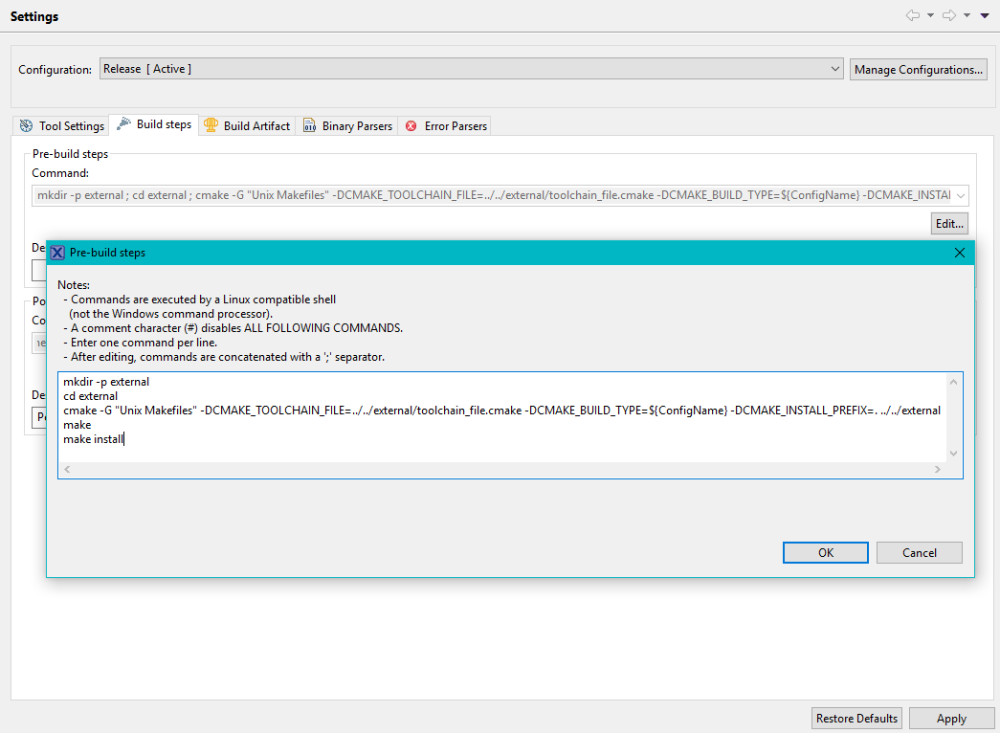
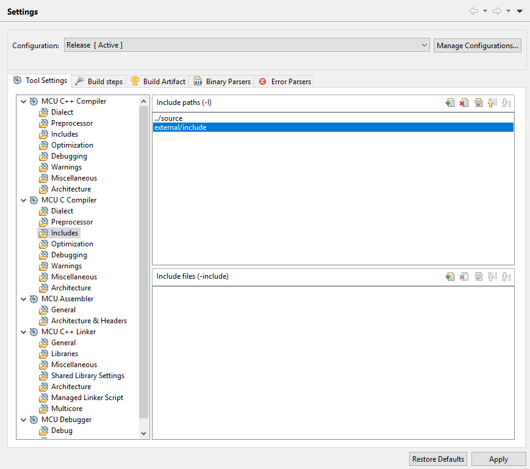
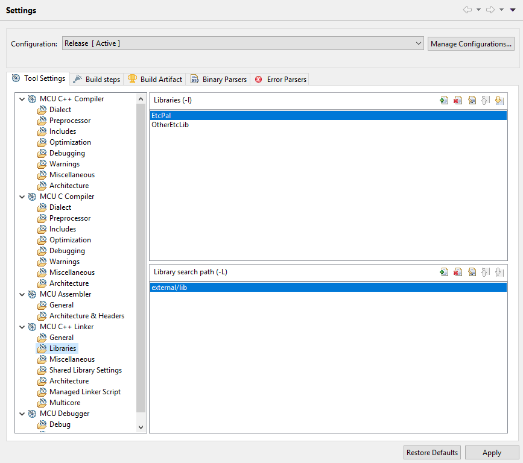

# Building EtcPal for an embedded target                                   {#building_for_embedded}

EtcPal is often included as a dependency by ETC libraries which are portable to embedded targets.
In this case, there are a couple of options for integrating EtcPal (and its dependent libraries)
into your project.

## Cross-compile using CMake (recommended)

CMake can be configured to invoke your embedded cross-compilation toolchain directly to build
EtcPal and other CMake libraries. This is done by providing a
[CMake toolchain file](https://cmake.org/cmake/help/latest/manual/cmake-toolchains.7.html)
when configuring the library with CMake.

The CMake toolchain file sets up CMake to find the tools you use to build your project and uses
those tools to build the CMake libraries as well. There are some example toolchain files for
various toolchains in the `cmake/cross-toolchains` directory. If your build tools use an
Eclipse-based IDE with an arm-gcc toolchain (a common setup), the file
`mcuxpresso-k65-freertos-lwip.cmake` serves as a good example.

When using CMake to build EtcPal, some target platforms require special targets or configuration to
allow EtcPal to find headers from external libraries. Special requirements for specific platforms
are found on the pages below:
* @subpage targeting_freertos
* @subpage targeting_lwip
* @subpage targeting_mqx

The method for including EtcPal via CMake is different depending on if your project already uses
CMake or not.

### If your project is a CMake project

EtcPal can be added to the build using the `add_subdirectory()` command. Before adding EtcPal as a
subdirectory, use the variables `ETCPAL_OS_TARGET` and `ETCPAL_NET_TARGET` to set the platforms
targeted by EtcPal. Some EtcPal target platforms require special targets to be created before
calling `add_subdirectory()`; examples are shown below.

```cmake
set(ETCPAL_OS_TARGET freertos CACHE STRING "The OS target for EtcPal")
set(ETCPAL_NET_TARGET lwip CACHE STRING "The network target for EtcPal")

# The "freertos" target platform requires a target called FreeRTOS, which EtcPal uses to find the
# FreeRTOS headers.
add_library(FreeRTOS [FreeRTOS sources...])
target_include_directories(FreeRTOS PUBLIC [freertos/include/paths...])

# The "lwip" target platform requires a target called lwIP, which EtcPal uses to find the lwIP
# headers.
add_library(lwIP [lwip sources...])
target_include_directories(lwIP PUBLIC [lwip/include/paths...])

add_subdirectory([path/to/EtcPal/root] EtcPal)
```

### If your project is not a CMake project

If your project does not use CMake, you can still consume EtcPal and dependent libraries using
CMake. Typically this is done by adding a root CMakeLists.txt one level up from the CMake libraries
you are building. A few common configurations with example directory structures are listed below.

**1. You are including EtcPal on its own.**

```
|- my_project/
|--- external/
|----- EtcPal/
|----- CMakeLists.txt
|----- toolchain.cmake
```

**2. You are including a library that depends on EtcPal from GitHub.**

In this case, the other library's CMake configuration will have brought EtcPal in as a Git
submodule and added it to the build using `add_subdirectory()`:

```
|- my_project/
|--- external/
|----- OtherEtcLib/
|------- external/
|--------- EtcPal/
|----- CMakeLists.txt
|----- toolchain.cmake
```

**3. You are including a library that depends on EtcPal which has been mirrored or copied into
     another source control provider.**

In this case, Git submodules are not available and you must copy the library and EtcPal at the same
level in the directory structure. The dependent library's CMake configuration will find EtcPal in
this location.

```
|- my_project/
|--- external/
|----- OtherEtcLib/
|----- EtcPal/
|----- CMakeLists.txt
|----- toolchain.cmake
```

The above configuration is also useful when you are using multiple libraries which all depend on
EtcPal.

The CMakeLists.txt contains enough information to build and install the libraries for use by your
main project toolchain. In this example, we are targeting FreeRTOS and lwIP. The CMakeLists.txt
would contain the following:

```cmake
cmake_minimum_required(VERSION 3.3)

set(ETCPAL_OS_TARGET freertos CACHE STRING "The OS target for EtcPal")
set(ETCPAL_NET_TARGET lwip CACHE STRING "The network target for EtcPal")

# The "freertos" target platform requires a target called FreeRTOS, which EtcPal uses to find the
# FreeRTOS headers. Replace "[freertos/include/paths/...]" with the actual paths (relative or
# absolute) to your FreeRTOS headers.
add_library(FreeRTOS INTERFACE)
target_include_directories(FreeRTOS INTERFACE [freertos/include/paths...])

# The "lwip" target platform requires a target called lwIP, which EtcPal uses to find the lwIP
# headers. Replace "[lwip/include/paths/...]" with the actual paths (relative or absolute) to your
# lwIP headers.
add_library(lwIP INTERFACE)
target_include_directories(lwIP INTERFACE [lwip/include/paths...])

add_subdirectory(EtcPal) # If using scenario 2 above, this line is omitted.
add_subdirectory(OtherEtcLib) # If using scenario 1 above, this line is omitted.
```

toolchain.cmake would contain information on your build toolchain as described above.

To integrate building these libraries into your project, it's convenient to configure and build the
libraries as a pre-build step in your existing toolchain. This example uses NXP's MCUXpresso IDE,
an Eclipse-based IDE similar to many other embedded toolchains. Conveniently, this IDE has a GNU
Make toolchain available on the PATH while executing pre- and post-build steps, so we can use the
Unix Makefiles CMake generator.



The pre-build step is:

```
mkdir -p external
cd external
cmake -G "Unix Makefiles" -DCMAKE_TOOLCHAIN_FILE=../../external/toolchain_file.cmake -DCMAKE_BUILD_TYPE=${ConfigName} -DCMAKE_INSTALL_PREFIX=. ../../external
make
make install
```

and does the following:
* Creates a new directory called "external" in the current build directory
* Configures EtcPal and its dependent libraries using your toolchain file and generates build files
  in the new directory
* Builds EtcPal and its dependent libraries
* Installs the built headers and artifacts in the new directory

At the end of the pre-build step, you will have artifacts available at a predictable path:

```
|- [build_directory]/
|--- external/
|----- include/
|------- [header files for all libraries]
|----- lib/
|------- [static libs for all libraries]
```

The final step is just to add those paths to your project's include/library paths:





With this configuration, each time you build your project, EtcPal and its dependent libraries will
be built if out-of-date and installed to be linked by your project.

## Include the sources in your project manually

It's recommended to use CMake to build EtcPal if possible. CMake is EtcPal's native build system;
this means that if you consume EtcPal via CMake, and you update to a later version where the list
of sources and/or include paths has changed, those changes will be integrated seamlessly into your
project without needing to change any settings.

However, if you do not want to use CMake to build EtcPal, you can include the EtcPal sources
directly into your project's build system.

There are two sets of sources to include: the platform-neutral sources and the platform-specific
sources.

The platform-neutral sources are located at `[etcpal_root]/src/etcpal/*.c`. The platform-specific
sources are located at `[etcpal_root]/src/os/[target_platform]/etcpal/*.c`. If you have multiple
target platforms (for example FreeRTOS and lwIP), you will need to include the sources under both
platform folders.

You will also need to update your include paths to include EtcPal's headers. For the public
headers, add `[etcpal_root]/include/` and `[etcpal_root]/include/os/[target_platform]`. You will
also need to add `[etcpal_root]/src/` to your include paths so that EtcPal can find its private
headers while it is building.
